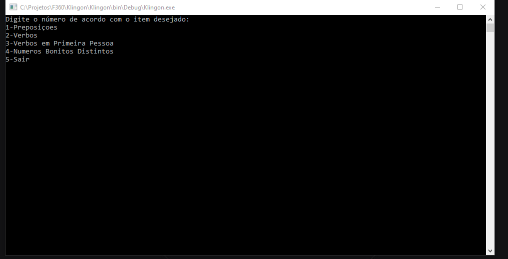

<h1>
  
</h1>

---

## 📝 Sobre 
Esse projeto foi desenvolvido para responder o desafio da F360. Consiste em um Console Application para escolha das opções desejadas, correspondendo às questões do formulário do desafio.

---

## 🚀 Tecnologias Utilizadas

O projeto foi desenvolvido utilizando as seguintes tecnologias: 
- C#
- Simple Injector
- Console Application

--- 
🙋‍♀️ Desenvolvido por: Leticia Deieno Tadeu
